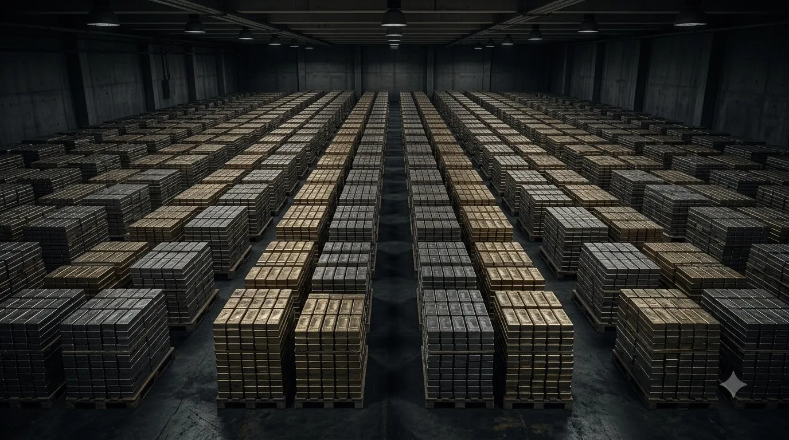
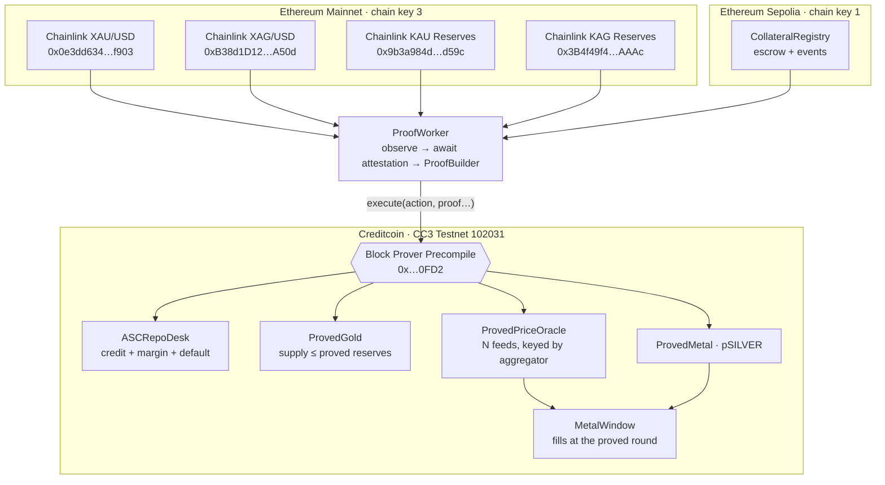

<div align="center">



# MEU Exchange

### Gold and silver on Creditcoin, priced and backed by proofs — not by an oracle operator.

*Real metal, real Chainlink feeds, carried to Creditcoin by the [Attestcoin Protocol](https://attestcoin.org/) — never relayed, never reported.*

[](https://creditcoin.org/)
[](https://docs.attestcoin.org/)
[](https://soliditylang.org/)
[](https://www.typescriptlang.org/)
[](#-verification)
[](#)

[**ASCRepoDesk**](https://creditcoin-testnet.blockscout.com/address/0x0231762F2F2285F6ea27Ad456E144C1371e4AF3B) · [**ProvedGold**](https://creditcoin-testnet.blockscout.com/address/0x2a8142Db4C3b90333339A6E25b225e808098BDB0) · [**ProvedMetal**](https://creditcoin-testnet.blockscout.com/address/0x74f6E83aA79a16CeD41Ec5b0697879E51e81cAd0) · [**Price Oracle**](https://creditcoin-testnet.blockscout.com/address/0x9B6eB52D26CeF7b04bb52b307Db86262bD8D6C8A)

</div>

---

## What is MEU Exchange?

A lending desk on a chain has to answer questions about chains it cannot see. *Is the collateral really escrowed? What is gold worth right now? Are the vault's reserves real?* Every existing answer routes through an operator who **writes** those numbers onto the lending chain — and that operator becomes the thing you trust.

MEU Exchange removes them. Four independently-operated Chainlink feeds live on Ethereum, where Creditcoin cannot read them. The Attestcoin Protocol carries each one across as a Merkle inclusion proof bound to an attested block, and the **block-prover precompile verifies it inside the same transaction that acts on it**.

The result is a desk where proofs are not decoration — they are preconditions for moving value:

- **Issue** — a metal token whose supply cannot exceed reserves proved from a Proof-of-Reserve feed.
- **Finance** — credit against metal escrowed on another chain, undrawable until the pledge is proved.
- **Trade** — a two-way window that fills at the last proved round, and closes when that round goes stale.

> **Why it matters:** most projects satisfy "no centralized oracle" by *displaying* attested data. Here the contract **refuses to act** without a proof — `NoReservesProved`, `UnexpectedStatus`, `StalePrice`. Each of those refusals is demonstrated on a live testnet below, with the transaction that failed and the transaction that then succeeded.

---

## Features

### The proof layer
- **Two ASCs** extend `ASCBase` and verify through the block-prover precompile at `0x…0FD2`. Every proof transaction carries two logs — precompile, then business logic — so no window exists where unverified data sits in storage.
- **Four live feeds, two roles** — `XAU/USD` and `XAG/USD` price the book; `KAU Reserves` and `KAG Reserves` cap issuance. All four are operated by Chainlink, not by us.
- **Binds the aggregator, never the proxy** — `EACAggregatorProxy` does not emit `AnswerUpdated`. Binding the proxy would silently receive nothing forever.
- **Rounds move strictly forward** — a replayed proof is still a *valid* proof; rejecting it is what stops the book being rewound.
- **Staleness is a hard stop** — past a 26-hour bound, issuance freezes and dealing windows close rather than trusting an old figure.

### The assets
- **Reserve-gated issuance** — `issue()` reverts unless `totalSupply() + amount <= provedReserves`. The cap is enforced against a number the issuer neither controls nor can forge.
- **Listing is configuration** — `ProvedMetal` takes name, symbol and reserve feed as constructor arguments; `ProvedPriceOracle` registers any aggregator in one transaction. Silver was listed end to end without a line of new contract code.
- **Unit-matched by design** — tokens are denominated in the feed's own unit, so the safety-critical cap needs no arithmetic. Gram-to-troy-ounce conversion lives in the pricing path, where a rounding error costs basis points instead of breaking the supply cap.

### The desk
- **Cross-chain collateral** — metal escrows on Ethereum Sepolia; credit is drawn on Creditcoin only after `CollateralPledged` is proved.
- **Advance rate against a proved mark** — 60% advance, 75% maintenance, measured at the last proved round.
- **Permissionless risk actions** — `markUndercollateralised` follows from a proved price; `markDefaulted` follows from *proved silence* at maturity. No privileged role decides either.
- **Fills you can audit** — every trade emits the Chainlink round id it filled at, so a trader can verify their price against a specific proved round.
- **Non-custodial** — the API returns unsigned calldata. The one key in the system pays gas for proof submission, and `execute` is permissionless and moves no value, so a compromised worker can never draw principal or release collateral.

---

## 🏛️ Architecture

Creditcoin runs the logic. Ethereum holds the evidence. Nothing writes back — Attestcoin writability is still in audit, so every flow here is one-directional by design.



| Layer | Role | Backed by |
|-------|------|-----------|
| **Evidence** | Prices and vault reserves | Chainlink aggregators on Ethereum |
| **Transport** | Inclusion + continuity proofs | **Attestcoin Protocol** · `@gluwa/usc-sdk` |
| **Verification** | Synchronous, in-transaction | Block-prover precompile `0x…0FD2` |
| **Logic** | Issuance, credit, dealing | `ASCBase` contracts on Creditcoin |

---

## How a proof becomes a decision

```
Chainlink round ─▶ attestors cover the block ─▶ ProofBuilder ─▶ execute(…)
                                                                   │
        contract acts ◀── business logic ◀── precompile verifies ◀──┘
```

1. **Emit** — a Chainlink aggregator publishes `AnswerUpdated`, or the Sepolia registry emits a custody event. Neither chain knows Creditcoin exists.
2. **Attest** — Attestcoin's attestors cover the source block (~40 blocks behind head in practice).
3. **Prove** — the worker pulls a Merkle inclusion proof bound to that attested block, plus a continuity proof linking it to Creditcoin's attestation record.
4. **Verify** — `ASCBase.execute` dedupes by `queryId` and calls the block-prover precompile. A failed proof reverts the whole transaction.
5. **Act** — `_processAndEmitEvent` decodes the receipt with `EvmV1Decoder`, checks the emitting address, and only then moves state: reserves raised, collateral locked, price marked.

---

## ✅ Verification

Every figure below was read off a live chain, not asserted.

### The refusals, then the successes

| Step | Result |
|---|---|
| `issue` before any reserve proof | **reverts** `NoReservesProved()` |
| `drawPrincipal` before the pledge is proved | **reverts** `UnexpectedStatus(…, 1)` · selector `0xaf4cf409` |
| `issue` 1 unit past proved headroom | **reverts** `ExceedsProvedReserves(2566134…, 2566133466…)` |
| Gold price proved from mainnet | [`0x7dbfd096…c855d`](https://creditcoin-testnet.blockscout.com/tx/0x7dbfd096940c90833c4923a2830608289b8532483a7f3212e32fbe0950cc855d) `GoldPriceProved(434913500000, 10212, …)` |
| Pledge proved from Sepolia | [`0xce551f35…1e4a`](https://creditcoin-testnet.blockscout.com/tx/0xce551f3536723aa4ef3819ab970d435f69b4ab058a16b8006a81a90529871e4a) `CollateralProved(…, 10 oz, …)` |
| **`drawPrincipal` after the proof** | [`0xbdae44c9…7e3e`](https://creditcoin-testnet.blockscout.com/tx/0xbdae44c945e53d3817f046981f06f4679e658e1d5fdd28f5d589cf13af5b7e3e) `PrincipalDrawn(…, 40 tCTC, 4598)` |

`4598` is the loan's LTV in basis points — **45.98%**, computed on-chain from the proved round: $20,000 drawn against $43,491.35 of bullion, inside the 60% advance rate.

### Both assets, on real feeds

| | Price feed | Reserve feed | Proved value | Trade |
|---|---|---|---|---|
| **pGOLD** | `XAU / USD` | `KAU Reserves` | $4,349.135/oz · 2,567,133.466 g | [`0x8f3ebb0c…c18d`](https://creditcoin-testnet.blockscout.com/tx/0x8f3ebb0c557791f6dfbdeeeea8336fe72c4045f12141c8f95df3737c6233c18d) `Bought(…, 10 g, $1,405.270767, 10212)` |
| **pSILVER** | `XAG / USD` | `KAG Reserves` | $64.486/oz · 3,688,827.985 g | [`0xbb122fab…aa5d`](https://creditcoin-testnet.blockscout.com/tx/0xbb122fab09d5f0c1e46aa6f9bddc79545f290827f09de881227f432e289eaa5d) `Bought(…, 100 g, $208.363940, 29850)` |

The trailing number in each `Bought` event is the Chainlink round the fill priced against.

### Deployed

**Creditcoin CC3 Testnet** · chain `102031` · [explorer](https://creditcoin-testnet.blockscout.com)

| Contract | Address |
|---|---|
| `ASCRepoDesk` | `0x0231762F2F2285F6ea27Ad456E144C1371e4AF3B` |
| `ProvedGold` (pGOLD) | `0x2a8142Db4C3b90333339A6E25b225e808098BDB0` |
| `ProvedPriceOracle` | `0x9B6eB52D26CeF7b04bb52b307Db86262bD8D6C8A` |
| `ProvedMetal` (pSILVER) | `0x74f6E83aA79a16CeD41Ec5b0697879E51e81cAd0` |
| `GoldWindow` | `0x2369B00a916132cBD3639bB29353d062f5fF325a` |
| `MetalWindow` (silver) | `0x2BE77D62F16438ce44c41120846321d871b73806` |
| `TestUSD` (tUSD) | `0x63b8493f7508Bea15b5D29A369E74D99Ac8932d6` |

**Ethereum Sepolia** · chain key `1`

| Contract | Address |
|---|---|
| `CollateralRegistry` | `0x3A053Dbffb16C033eF16eBcD4dE45673BE3346d4` |
| `TestBullion` (tXAU) | `0x626DA908bdE6F66f9178B3128dd17D82dc74CE21` |

**Ethereum Mainnet** · chain key `3` · read-only, never written to

| Feed | Aggregator (the emitter, not the proxy) |
|---|---|
| `XAU / USD` | `0x0e3dd634FFbF7EA89BbDCF09Ccc463302FD5f903` |
| `XAG / USD` | `0xB38d1D12Ba17aA62255e588a0bC845c1a589A50d` |
| `KAU Reserves` | `0x9b3a984d1abbe03845CBa7A895f1ff7f4209d59c` |
| `KAG Reserves` | `0x3B4f49f4aa5491B5a60C0724467A67b4910aEAAc` |

```bash
npm run test:contracts    # 55 Solidity tests
npm test                  # 17 API / domain tests
npm run check:attestation # live attested heights for both source chains
npm run preflight         # RPCs, attestation lag, feed reachability, balances
```

---

## Listing an RWA asset

Four steps, none of which require new contract code:

1. **The asset needs a Proof-of-Reserve feed** on an attested chain. This is the gate, and it is deliberate — the feed is trustworthy precisely because the issuer does not operate it.
2. **Deploy `ProvedMetal`** with its name, symbol and that aggregator. Supply is now capped by proved reserves, permanently.
3. **Register its price feed** — `registerAggregator(...)` on `ProvedPriceOracle`, one transaction.
4. **Deploy a `MetalWindow`** against that aggregator to make it tradeable, and `registerCollateralAsset(...)` on the desk to make it borrowable.

Then add the feeds to `LISTED_FEEDS` and the asset to `LISTINGS`, and the worker and dashboard pick it up. Silver went through exactly this path.

---

## The Dashboard

| Tab | What it does |
|-----|--------------|
| **Overview** | Listed assets with live two-way quotes, TradingView spot reference beside the proved round, buy/sell per asset |
| **Attestcoin** | The proof path — attested source chains, proof builder, block prover, bound emitters |
| **Repo lifecycle** | Proved pledges, drawn principal, releases and defaults |
| **Proof queue** | Every source-chain event between emission and on-chain verification |

The TradingView chart is labelled **"not the proved price"** on purpose. Market spot and the proved round sit side by side so the gap between them is visible — that gap *is* attestation lag.

---

## Quickstart

```bash
npm install
git clone --depth 1 https://github.com/foundry-rs/forge-std lib/forge-std
cp .env.example .env          # add DEPLOYER_PRIVATE_KEY, fund it with Sepolia ETH + tCTC

npm run preflight             # must print "Ready."
./scripts/deploy.sh           # deploys, binds registry + aggregator + risk params

npm run dev                   # Hono API on :3000
npm run worker                # proof worker — run exactly one
npm run dev:web               # Astro landing + /dashboard on :4321
```

Requires Node 22+ and Foundry (tested on forge 1.7.1).

| Script | What it does |
|--------|--------------|
| `npm run demo <terms\|pledge\|draw\|repay\|release\|status>` | Drives the repo lifecycle end to end |
| `npm run gold <status\|issue>` · `npm run window <status\|fund\|buy\|sell>` | Issuance and dealing |
| `npm run preflight` · `npm run check:attestation` | Pre-deploy checks and live attestation lag |
| `npx tsx scripts/inspect-tx.ts <hash>` · `scripts/why-revert.ts` | Decode a proof receipt, or name a refusal |

---

## 📄 License

No license file has been committed yet — all rights reserved until one is added.

<div align="center">
<sub>Built on <a href="https://creditcoin.org/">Creditcoin</a> · <a href="https://docs.attestcoin.org/">Attestcoin Protocol</a> · <a href="https://chain.link/">Chainlink</a> · Foundry · Astro</sub>
</div>
